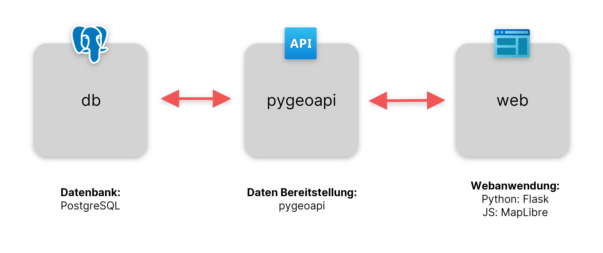
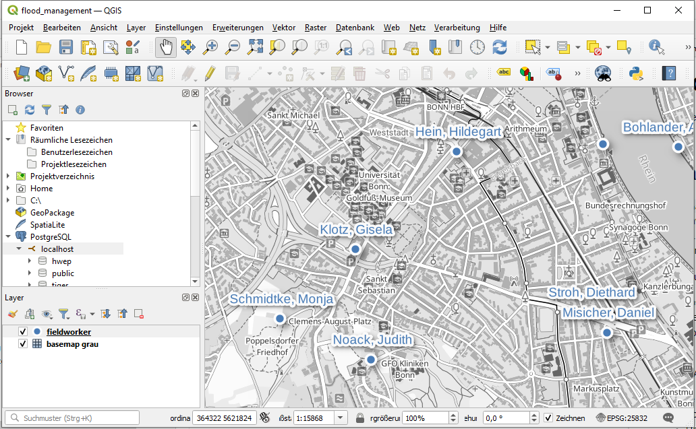

# Zusammenfassung

`Flood Management` ist ein Prototyp einer Geo-Anwendung, die im Falle eines Hochwassers zur Einsatzplanung dienen soll. 
Die fertige Anwendung soll eine Webanwendung und eine mobile Anwendung beinhalten. 
Im Katastrophenfall soll die Webanwendung für Einsatzleiter alle relevanten Informationen auf einen Blick darstellen und 
die Möglichkeit geben Instruktionen an Einsatzkräfte zu geben. 
Die mobile Anwendung soll den Einsatzkräften die Möglichkeit geben relevante Daten zu übermitteln und Instruktionen zu
erhalten.

Diese Features wurden in dieser Anwendung umgesetzt:
* Die Position von Einsatzkräften während eines Einsatzes... 
  * werden in einer Datenbank gespeichert
  * über eine REST-API bereitgestellt
  * in einer Webanwendung dargestellt 

Die fertige Anwendung soll unter anderem über folgende Features verfügen:

* mobile Anwendung 
  * Positionsübermittlung
  * Hochladen von Fotos
  * Manuelles Eintragen von Pegelständen, wo keine automatische Übertragung stattfindet
  * Zwischenspeichern von Änderungen, wenn kein Netz verfügbar
* Webanwendung
  * Darstellung von Anlagen zum Hochwasserschutz
  * Darstellung des Pegelstands der Gewässer
    * Maßnahmen richten sich nach Pegelstand
    * Simulation unterschiedlicher Pegelstände
  * Login mit Rechte-Rollenkonzept und ggfs. unterschiedliche Darstellung

# Architektur



## Dienste:
* Der `db`-Dienst stellt das Datenbank-Backend bereit, dort sind in der Tabelle `fieldworker` die Positionen, sowie die 
Namen der Einsatzkräfte abgelegt. 

* Der `pygeoapi`-Dienst stellt die API zum Zugriff auf die Geodaten über eine REST-Schnittstelle bereit. Diese 
entspricht dem Standard der [OGC-API Features](https://ogcapi.ogc.org/features/). Die Daten werden in sogenannten 
Collections organisiert. Innerhalb einer Collection sind die eigentlichen Datensätze, welche als JSON Datei abgefragt 
werden können. Die API basiert, wie bei REST üblich, auf HTTP. Die Datensätze können über dieselbe Schnittstelle auch als
Webseite - also als HTML - abgefragt und im Browser dargestellt werden. Im konkreten Fall gibt es nur den Datensatz 
`fieldworker`, welcher der Tabelle in der Datenbank entspricht.

* Der `web`-Dienst ist das Front-End für die Geo-Anwendung und stellt eine Weboberfläche zur Verfügung. Sie ist der Teil, 
welchen der Nutzer am Ende sieht. Dort werden die Punktdaten auf einer Hintergrundkarte 
([Basemap-Vektor-Grau](https://sgx.geodatenzentrum.de/gdz_basemapde_vektor/styles/bm_web_gry.json)) dargestellt. Die 
Anwendung verwendet als Framework für die Webseite die Python Bibliothek [Flask](https://flask.palletsprojects.com/). 
Für die Kartendarstellung wird auf die JavaScript-Bibliothek [MapLibre](https://maplibre.org/) gesetzt.

# Anwendungsfall

Im Anwendungsfall soll sich die Einsatzkräfte über ein Mobiltelefon oder Tablet am System einloggen (Dies ist für die 
Beispielanwendung nicht implementiert). Wird über das Gerät der Standort geteilt, kann er somit an die Datenbank 
übermittelt werden. Die Position des Nutzers wird dann dort aktualisiert und kann dann in der Anwendung dargestellt 
werden. Über die Webanwendung sollen die Einsatzkräfte durch einen Einsatzleiter koordiniert werden (Nicht 
implementiert). Die Einsatzkräfte könnten beispielsweise einen Zielort, an den sie sich bewegen sollen, zugewiesen 
bekommen.

# Build

Die Anwendung setzt auf [Docker-Compose](https://docs.docker.com/compose/). Bitte installieren Sie Docker-Compose 
entsprechend der [Anleitung](https://docs.docker.com/compose/gettingstarted/).

Zum Bauen der Anwendung klonen Sie das Repository und verwenden Sie folgenden Befehl im Root-Verzeichnis:

```shell
docker-compose build
```

# Starten der Anwendung

Verwenden Sie folgenden Befehl im Root-Verzeichnis des Projekts:

```shell
docker-compose up -d
```
Danach sollte die Anwendung über http://localhost:8000 erreichbar sein.

# Eingabe von Daten

Zur Eingabe der Daten muss zunächst der Datenbankdienst laufen
(siehe [Starten der Anwendung](#Starten-der-Anwendung)).

## Eingabe von Hand

Daten können über das [QGIS-Projekt](qgis/flood_management.qgz) eingegeben werden. Dazu muss zunächst die Tabelle 
angelegt werden: [db.sql](db/db.sql)



## Automatisches Generieren von Daten

Sie können auch automatisch über [fill_db.py](db/fill_db.py) generiert werden.

# License

Die Anwendung ist lizenziert unter der [GPL v3](LICENSE)
